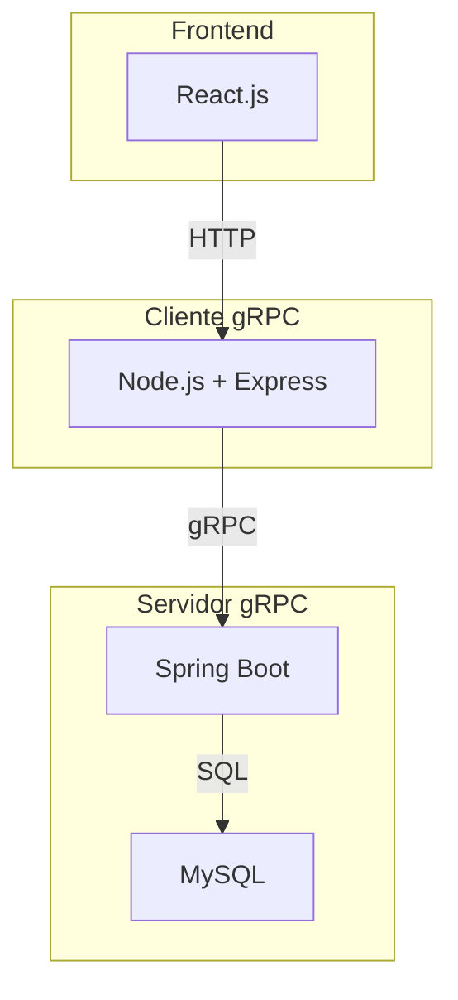

# TP Sistemas Distribuidos - Grupo C - Backend

Este backend implementa la lógica de negocio y la comunicación distribuida para el sistema de la **ONG Empuje Comunitario**.
Está compuesto por dos módulos principales que trabajan de forma integrada:

- **Servidor gRPC**: desarrollado en **Spring Boot + MySQL**, expone los servicios de negocio vía gRPC.

- **Cliente gRPC**: desarrollado en **Node.js + Express**, funciona como **gateway HTTP** entre el frontend y el servidor gRPC.

---

### 🏗️ **Arquitectura General**

- El **frontend** consume endpoints HTTP.

- El **cliente gRPC** traduce esas peticiones en llamadas gRPC.

- El **servidor gRPC** resuelve la lógica de negocio y persiste en MySQL.

---

### 📦 **Módulos**

- [Servidor gRPC](./grpc_server/README.md)

  Implementa toda la lógica de negocio, persistencia en MySQL y expone métodos gRPC.

- [Cliente gRPC](./grpc_client/README.md)

  Expone endpoints HTTP que traducen las peticiones hacia el servidor gRPC y devuelven respuestas JSON al frontend.

---

### 👥 **Roles y permisos**

| Rol             | Acciones principales                                             |
| --------------- | ---------------------------------------------------------------- |
| **PRESIDENTE**  | Gestión completa de usuarios, inventarios, donaciones y eventos. |
| **COORDINADOR** | Gestión de donaciones y eventos.                                 |
| **VOCAL**       | Gestión de inventarios.                                          |
| **VOLUNTARIO**  | Participación en eventos (alta/baja).                            |

---

### 📌 **Funcionalidades principales**

- **Usuarios**: creación, login, modificación, baja lógica, validación de duplicados.

- **Inventarios**: alta/baja lógica, acumulación de stock, validación categoría + descripción.

- **Donaciones**: creación con validación de stock, listado por evento.

- **Eventos Solidarios**: creación, modificación, eliminación, gestión de participantes y registro de donaciones.

- **Roles**: listado y control de permisos.

---

👉 Para más detalle sobre cada módulo, revisar los READMEs:

- [Servidor gRPC](./grpc_server/README.md)
- [Cliente gRPC](./grpc_client/README.md)

⚙️ **Nota**: Para pruebas locales, el servidor gRPC puede interactuar con servicios auxiliares como MailHog, Kafka y Kafbat UI, los cuales se levantan vía Docker (ver [README Servidor gRPC](./grpc_server/README.md) para más detalles).