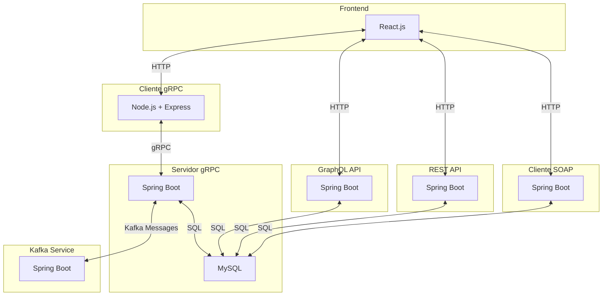

# TP Sistemas Distribuidos - Grupo C - Backend

Este backend implementa la lógica de negocio y la comunicación distribuida para el sistema de la **ONG Empuje Comunitario**.
Está compuesto por tres módulos principales que trabajan de forma integrada:

- **Servidor gRPC**: desarrollado en **Spring Boot + MySQL**, expone los servicios de negocio vía gRPC.

- **Cliente gRPC**: desarrollado en **Node.js + Express**, funciona como **gateway HTTP** entre el frontend y el servidor gRPC.

- **Service Kakfa**: desarrollado en **Spring Boot** para manejar la mensajería interna entre organizaciones (topics fijos y dinámicos).

- **Service GraphQL**: desarrollado en **Spring Boot** con el objetivo de proporcionar informes sobre las donaciones entrantes y salientes de la ONG y sobre los eventos de la ONG, y permitir la gestión de filtros sobre las donaciones por usuario.

- **Service REST**: desarrollado en **Spring Boot** con el propósito de entregar informes sobre las donaciones entrantes y salientes de la ONG en formato de Excel y permitir la gestión de filtros sobre los eventos por usuario.

- **Cliente SOAP**: desarrollado en **Spring Boot** con las funciones de permitir el acceso a información sobre las demás ONGs y sus presidentes al presidente de la ONG.

---

### 🏗️ **Arquitectura General**

- El **frontend** consume endpoints HTTP.

- El **cliente gRPC** traduce esas peticiones en llamadas gRPC.

- El **servidor gRPC** resuelve la lógica de negocio y persiste en MySQL.

- El **Kakfa Service** administra la mensajería mediante topics fijos (`eventos-solidarios`, `solicitud-donaciones`, etc.) y dinámicos (`adhesion-evento-<idOrganizador>`, `transferencia-donaciones-<idOrganizacion>`).

- El **GraphQL Service** actúa como intermediario entre el frontend y la base de datos para presentar informes de donaciones y eventos de la ONG, como también gestionar ABM de filtros sobre las donaciones por usuario.

- El **REST Service** actúa como intermediario entre el frontend y la base de datos para permitir un ABM de filtros sobre los eventos por usuario, además de entregar un informe de las donaciones en formato de Excel.

- El **Cliente SOAP** permite al PRESIDENTE de la ONG acceder a información sobre las demás ONGs y sus presidentes peticionando al Servidor SOAP.

---

### 📦 **Módulos**

- [Servidor gRPC](./grpc_server/README.md)

  Implementa toda la lógica de negocio, persistencia en MySQL y expone métodos gRPC.

- [Cliente gRPC](./grpc_client/README.md)

  Expone endpoints HTTP que traducen las peticiones hacia el servidor gRPC y devuelven respuestas JSON al frontend.

- [Kafka Service](./kakfa_service/README.md)

  Microservicio independiente que colabora con gRPC para manejar mensajería, con topics fijos y dinámicos, y que luego la información puede reflejarse en la base de datos.

- [GraphQL Service](./graphql_service/README.md)

  Microservicio independiente que consulta a la base de datos y expone endpoints para ofrecer al usuario informes sobre las donaciones y eventos de la ONG, además de una gestión de ABM por usuario de los filtros sobre las donaciones.

- [REST Service](./rest_service/README.md)

  Microservicio independiente que consulta a la base de datos y expone endpoints para ofrecer al usuario informes sobre las donaciones en formato de Excel, además de una gestión de ABM por usuario de los filtros sobre los eventos.

- [Cliente SOAP](./soap_service/README.md)

  Microservicio independiente que permite al PRESIDENTE de la ONG acceder a información acerca de las  demás ONGs y sus presidentes.

---

### 👥 **Roles y permisos**

| Rol             | Acciones principales                                             |
| --------------- | ---------------------------------------------------------------- |
| **PRESIDENTE**  | Gestión completa de usuarios, inventarios, donaciones y eventos. |
| **COORDINADOR** | Gestión de donaciones y eventos.                                 |
| **VOCAL**       | Gestión de inventarios.                                          |
| **VOLUNTARIO**  | Participación en eventos (alta/baja).                            |

---

### 📌 **Funcionalidades principales**

- **Usuarios**: creación, login, modificación, baja lógica, validación de duplicados.

- **Inventarios**: alta/baja lógica, acumulación de stock, validación categoría + descripción.

- **Donaciones**: creación con validación de stock, listado por evento.

- **Eventos Solidarios**: creación, modificación, eliminación, gestión de participantes y registro de donaciones.

- **Roles**: listado y control de permisos.

---

👉 Para más detalle sobre cada módulo, revisar los READMEs:

- [Servidor gRPC](./grpc_server/README.md)
- [Cliente gRPC](./grpc_client/README.md)
- [Kafka Service](./kakfa_service/README.md)
- [GraphQL Service](./graphql_service/README.md)
- [REST Service](./rest_service/README.md)
- [Cliente SOAP](./soap_service/README.md)

⚙️ **Nota**: Para pruebas locales, el servidor gRPC puede interactuar con servicios auxiliares como MailHog, Kafka y Kafbat UI, los cuales se levantan vía Docker (ver [README Servidor gRPC](./grpc_server/README.md) para más detalles).